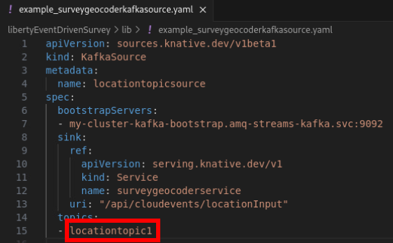

<PageDescription>

As modern enterprises increasingly adopt cloud-native and serverless architectures, the need for agile and efficient microservices has never been greater. This lab guides you through the construction of cloud-native microservices with instant startup time for event-driven architectures using IBM WebSphere Liberty InstantOn. These capabilities translate to potential cost savings by dynamically managing applications according to demand.

</PageDescription>

# Notices and disclaimers

© 2024 International Business Machines Corporation. No part of this document may be reproduced or transmitted in any form without written permission from IBM.

U.S. Government Users Restricted Rights — use, duplication or disclosure restricted by GSA ADP Schedule Contract with IBM.

This document is current as of the initial date of publication and may be changed by IBM at any time. Not all offerings are available in every country in which IBM operates.

Information in these presentations (including information relating to products that have not yet been announced by IBM) has been reviewed for accuracy as of the date of initial publication and could include unintentional technical or typographical errors. IBM shall have no responsibility to update this information. 

This document is distributed “as is” without any warranty, either express or implied. In no event, shall IBM be liable for any damage arising from the use of this information, including but not limited to, loss of data, business interruption, loss of profit or loss of opportunity. IBM products and services are warranted per the terms and conditions of the agreements under which they are provided. The performance data and client examples cited are presented for illustrative purposes only. Actual performance results may vary depending on specific configurations and operating conditions.

IBM products are manufactured from new parts or new and used parts. In some cases, a product may not be new and may have been previously installed. Regardless, our warranty terms apply.”

Any statements regarding IBM's future direction, intent or product plans are subject to change or withdrawal without notice.

Performance data contained herein was generally obtained in a controlled, isolated environments. Customer examples are presented as illustrations of how those customers have used IBM products and the results they may have achieved. Actual performance, cost, savings or other results in other operating environments may vary. 

References in this document to IBM products, programs, or services does not imply that IBM intends to make such products, programs or services available in all countries in which IBM operates or does business. 

Workshops, sessions and associated materials may have been prepared by independent session speakers, and do not necessarily reflect the views of IBM. All materials and discussions are provided for informational purposes only, and are neither intended to, nor shall constitute legal or other guidance or advice to any individual participant or their specific situation.

It is the customer’s responsibility to ensure its own compliance with legal requirements and to obtain advice of competent legal counsel as to the identification and interpretation of any relevant laws and regulatory requirements that may affect the customer’s business and any actions the customer may need to take to comply with such laws. IBM does not provide legal advice or represent or warrant that its services or products will ensure that the customer follows any law.

Questions on the capabilities of non-IBM products should be addressed to the suppliers of those products. IBM does not warrant the quality of any third-party products, or the ability of any such third-party products to interoperate with IBM’s products. IBM expressly disclaims all warranties, expressed or implied, including but not limited to, the implied warranties of merchantability and fitness for a purpose.

The provision of the information contained herein is not intended to, and does not, grant any right or license under any IBM patents, copyrights, trademarks or other intellectual property right.

IBM, the IBM logo, and ibm.com are trademarks of International Business Machines Corporation, registered in many jurisdictions worldwide. Other product and service names might be trademarks of IBM or other companies. A current list of IBM trademarks is available on the Web at “Copyright and trademark information” at
<https://www.ibm.com/legal/copyright-trademark>.

# Background

First, we will cover important background concepts. Optionally, click embedded hyperlinks to learn more about subjects that you're interested in diving deeper into (you can middle click if available on your mouse, or `Right Click` } `Open Link in New Tab` to open external links in a new browser tab to make it easier to come back to where you were).

## IBM WebSphere Liberty

[IBM WebSphere Liberty](https://www.ibm.com/websphere/liberty) is a next-generation Java application runtime that accelerates the delivery of cloud-native applications. WebSphere Liberty is largely based on the open-source [Open Liberty](https://github.com/OpenLiberty/open-liberty) project so some links and examples may point to Open Liberty documentation.

[Liberty InstantOn](https://www.ibm.com/docs/en/was-liberty/core?topic=images-faster-startup-instanton) is a feature of WebSphere Liberty that provides [fast startup times](https://openliberty.io/docs/latest/instanton.html) for Java applications (with [some limitations](https://openliberty.io/docs/latest/instanton.html#supported-features)). With InstantOn, your applications can start in milliseconds without compromising on throughput, memory, development-production parity, or Java language features. Liberty InstantOn uses a feature of the Linux kernel called Checkpoint/Restore In Userspace (CRIU) available since Linux 5.9 along with features available in IBM Semeru Runtimes Java (the successor to IBM Java) in coordination with the Liberty runtime.

The way InstantOn works is that your build process (which could be a developer workstation or a build pipeline) uses a WebSphere [Liberty InstantOn capability](https://openliberty.io/docs/latest/instanton.html#build) to take a snapshot of the Java process after it has started within the build phase (either before or after the application starts [depending on application requirements](https://openliberty.io/docs/latest/instanton.html#beforeAppStart)). Then, the resulting snapshotted image can be reconstituted many times at runtime, largely skipping most of the startup time without compromising on Java language features. You can think of it like the common "hibernate" feature of operating systems where a computer's RAM is written to disk and then reconstituted later except that with InstantOn, the process can be reconstituted many times in parallel. Special code inside Linux, IBM Semeru Runtimes Java, and Liberty "patch up" each resulting process to reset security random values, reconstitute open ports, etc.

## Linux Containers

The Linux "[container](https://www.redhat.com/en/topics/containers)" technology provides virtualization and isolation which is more lightweight than full virtual machines (VMs) (though containers themselves are often run on top of VMs). This is accomplished by using Linux kernel [cgroups](https://docs.redhat.com/en/documentation/red_hat_enterprise_linux/9/html/managing_monitoring_and_updating_the_kernel/setting-limits-for-applications_managing-monitoring-and-updating-the-kernel#understanding-control-groups_setting-limits-for-applications). Containers generally share the underlying operating system of the worker node while virtualizing and isolating CPU, memory, disk, and network resources.

First, you will build container images and then publish them to an image registry. The container runtime will then materialize the images into running container processes.

## Docker and podman

[Docker](https://www.docker.com/), [podman](https://podman.io/), CRI-O, runC, crun, and various other technologies are used to build and/or run containers.

This lab uses podman in a Linux client virtual machine to build and publish the containers, and runC in Red Hat OpenShift to run the containers.

## Microservices

Linux containers have been married with certain development approaches such as Dockerfiles/Containerfiles for building executable container images using layers and pushing to container registries, continuous integration and development (CI/CD) pipelines, and more.

One of the transformative architectures that Linux containers have accelerated is a [microservices architecture](https://www.ibm.com/topics/microservices). The idea is that once it's easier to build virtualized and isolated components, this allows breaking up traditional "monolith" applications into smaller and more nimble applications that talk to each other for faster development iteration and independent scaling capabilities. New Java application development standards have been developed to support the microservices architectural style and one such open source standard supported by IBM is [Eclipse MicroProfile](https://microprofile.io/). Liberty is one application server that implements the MicroProfile standard. Microservices may also be developed using other technologies such as Spring and all of the concepts in this lab will apply to such alternative technologies, but for this demonstration, we will be using Eclipse MicroProfile.

## Kubernetes

[Kubernetes](https://kubernetes.io/) is an open source container orchestration technology that provides services such as application clustering, load balancing, auto-scaling, security, container resource limits, access management, and more.

Kubernetes introduces the concept of a [pod](https://kubernetes.io/docs/concepts/workloads/pods/) which is a collection of containers, although it is common for a pod to have a single container. A pod is the unit of an application deployment and allows for easily augmenting application capabilities with "sidecar" containers or starting lightweight diagnostic containers with access to the main container. This lab will use pods with just a single container for each microservice.

## Kubernetes Operator

A [Kubernetes Operator](https://kubernetes.io/docs/concepts/extend-kubernetes/operator/) is a pattern to implement configuration-driven resource management. You can define the state of what you want things to be in and an operator manages resources in a continuous loop to try to ensure that state is maintained. For example, a Kubernetes application [Deployment](https://kubernetes.io/docs/concepts/workloads/controllers/deployment/) may be configured to maintain a minimum number of replicas of an application so the operator continuously watches when the number of instances drops below that number and then tries to start more instances.

## Red Hat OpenShift

[Red Hat OpenShift](https://www.redhat.com/en/technologies/cloud-computing/openshift) is an enhanced Kubernetes distribution provided by Red Hat. OpenShift [uses](https://docs.openshift.com/container-platform/latest/nodes/containers/nodes-containers-using.html#nodes-containers-runtimes) the CRI-O container engine and crun or runC (default) as the container runtime. This lab uses a Red Hat OpenShift cluster to run the application.

## Event Driven Architecture

An Event Driven Architecture (EDA) reacts to messages through message queues and topics such as through message brokers like [IBM MQ](https://www.ibm.com/products/mq). EDA is generally more asynchronous than a classic website that synchronously responds to HTTP requests. Classically, EDA was implemented in Java through Message Driven Beans (MDBs) using the Java Message Service (JMS) or a similar technology.

## Apache Kafka

[Apache Kafka](https://kafka.apache.org/) is an open source, distributed message store and data streaming technology. It has some similarities to JMS and some differences which we won't cover here but suffice it to note that Kafka is another technology to enable an Event Driven Architecture using asynchronous message-driven Java development akin to JMS topics and it will be demonstrated in this lab.

##  Red Hat Streams for Apache Kafka

[Red Hat Streams for Apache Kafka](https://docs.redhat.com/en/documentation/red_hat_streams_for_apache_kafka/2.7/html-single/getting_started_with_streams_for_apache_kafka_on_openshift/index#getting_started_overview) is an optional operator in Open Shift that installs and maintains Apache Kafka instances and related capabilities. [IBM Event Streams](https://www.ibm.com/products/event-streams) is a very similar offering that could also be used.

The Red Hat Streams for Apache Kafka operator has been pre-installed in this lab and the application will use its instance of Apache Kafka although you will not be configuring it nor directly interacting with it. You are welcome to explore it but the OpenShift cluster is shared so be careful not to perform any modifications.

##  CloudEvents

[CloudEvents](https://cloudevents.io/) is an open standard for describing an event which is passed from a message broker to an external system such as an HTTP endpoint. More basically, you can think of it as a standardized way to convert an event into an HTTP call.

##  Serverless

[Serverless computing](https://www.ibm.com/topics/serverless) is a model that enables developers to build and run application code without provisioning or managing servers or back-end infrastructure upfront. Instead, as work comes in, if there are no resources yet available to process that work, then resources (such as a pod) are dynamically requested to be started ("scale-from-zero"), or work is queued for the next available resource if the pool of resources has reached a configured limit.

A serverless architecture is an option for an Event Driven Architecture and allows for resources to spin up and down based on the availability of incoming events. This allows for the concept of automatic "scale-to-zero" where resources are automatically spun down when there are no events in the system thus potentially driving cost savings.

The problem with a serverless architecture is that the startup time and startup CPU cost of an application becomes much more important as resources are constantly spun up and down. This is where Liberty InstantOn comes into the picture to allow for nearly instant startup time in response to serverless workloads (InstantOn can also be used in more classic architectures to simply speed up application start up time and reduce resource usage).

##  Knative

[Knative](https://knative.dev/) is an open source implementation of serverless for Kubernetes.

Knative Serving is a component of Knative that handles load distribution of HTTP-based applications. When an HTTP request comes into a Knative Serving instance, it will be queued there until a container instance is available to serve the application.

Knative Eventing is a component of Knative that handles load distribution and queuing of events from a message broker. Knative Broker for Apache Kafka is a component of Knative that is designed to integrate Knative Eventing with Apache Kafka. When an event comes into Apache Kafka, eventing and the broker can be configured to send that event to HTTP-based applications through Knative Serving by converting the event to CloudEvents and then calling a KNative Serving serverless endpoint with the event as a POST body.

##  Red Hat OpenShift Serverless

[Red Hat OpenShift Serverless](https://docs.openshift.com/serverless/1.29/about/about-serverless.html) is an optional operator in Open Shift that installs and maintains a Knative implementation in an OpenShift cluster.

This operator has been pre-installed in this lab and the application will use it although you will not be configuring it nor directly interacting with it. You are welcome to explore it but the OpenShift cluster is shared so be careful not to perform any modifications.

##  MicroProfile Reactive Messaging

[Eclipse MicroProfile Reactive Messaging](https://openliberty.io/guides/microprofile-reactive-messaging.html) is a part of Eclipse MicroProfile and a microservices programming style to implement Java producers and consumers for messaging engines such as Apache Kafka. [Reactive programming](https://developer.ibm.com/articles/defining-the-term-reactive/) is a natural way to build asynchronous applications.

This lab will be using [WebSphere Liberty's mpReactiveMessaging-3.0 feature](https://www.ibm.com/docs/en/was-liberty/core?topic=features-microprofile-reactive-messaging-30) which implements Eclipse MicroProfile Reactive Messaging version 3.

# Demonstration Application

## Architecture

Putting all the concepts above together, we will be demonstrating an application that is an event-driven survey. You will act as both the survey proctor and survey participant. A speaker (survey proctor) shows a map on the screen and asks audience members (survey participants) to scan a QR code on their phone and enter what city they've come from. Each submission of the HTML form puts an event on an Apache Kafka topic. A consumer of this topic is a microservice that reads the user's input and geocodes the location into a latitude and longitude point. This is pushed to another topic and the speaker's map then dynamically adds this pin.

Here is the basic architecture. All of the different microservices can scale down to zero and scale up from zero based on either the form submissions or the Apache Kafka events being generated.


The detailed architecture shows all of the microservices involved and the detailed flows:


It is worth dwelling on the eventing flow to understand exactly how a message from Apache Kafka gets to the microservice:


An event is pushed onto an Apache Kafka topic. The KnativeKafkaBroker is a component of Knative to integrate and process message using Apache Kafka. If a Knative KafkaSource is defined to handle the event's topic, then the KafkaSource will send the event to a Knative Service. The event will be packaged and sent over HTTP using the open standard CloudEvents format which then a microservice can handle. This works particularly well with scale-to-zero to dynamically scale asynchronous handlers as demand warrants.

Unlike classic reactive messaging interactions with a message broker, to utilize Knative eventing, instead of having an @Incoming consumer, Knative converts the event into a Knative Serving call into an HTTP endpoint after the user input application uses a normal Emitter to send the message to Kafka:


## Lab

This lab will go through the process of deploying and configuring the application describe above. Along the way, we'll describe noteworthy details in the following blue boxes. If you are already familiar with a step, then you may optionally skip these "learn more" boxes:

<InlineNotification>

These "learn more" boxes will be peppered throughout the lab steps to explain steps in more detail. We encourage you to read these or at least skim them to get a detailed understanding how everything works.

</InlineNotification>

Let's get started!

### Access the Client Machine

The client machine will perform the build of the application and offers a browser for accessing the application and Red Hat OpenShift.

1. The first screen you'll see is a grid of all of the virtual machines:
   
   

1. Scroll down and find the machine with a name that ends in **student** and click on the Red Hat logo on the computer screen. For example:
   
   

1. Clicking on the "Red Hat" logo will open a new browser tab to the client virtual machine.

1. If you see the following screen, then the screen is locked. Click anywhere on the screen and enter the password **Passw0rd** (with a capital P and a **zero** rather than an O) to login:
   
   
   
   

1. If you see the following screen then you are already logged in:
   
   

### Copy and Pasting

Throughout the lab, you may copy and paste from this lab guide into the client virtual machine:

1. Ensure the target of the paste has focus in the virtual machine

1. Click the Send Text icon at the top of the client virtual machine browser tab:
   
   

1. Paste something into the textbox and then click Send Text:
   
   

1. Double check that the text has pasted correctly as we have seen cases where not all characters were sent.

If you are having any issues copy/pasting within the virtual machine, you may use right click to perform either action instead.

### Create the OpenShift Project

The first thing we need to do is to create the project and the Kafka topics in OpenShift that your application instance will use:

1. Click on the Firefox icon to open the browser:
   
   

1. Click on the OpenShift Console bookmark:
   
   

1. The user name and password should be auto-filled and you can simply click **Log in** but in case you need them for any reason the user name is **ocadmin** and the password is **ibmrhocp**
   
   

1. It is a good habit to always double check that the Cluster and Control Plane OpenShift/Kubernetes components are green check marks on the Overview homepage. If either are not green, please notify a proctor or IBM support person before you continue the lab:
   
   

1. Create a new project by expanding Home and clicking on Projects:
   
   
   
   <InlineNotification>
   
   An OpenShift project is equivalent to a [Kubernetes namespace](https://kubernetes.io/docs/concepts/overview/working-with-objects/namespaces/). A project/namespace isolates resources into a logical grouping. Resources are uniqualy defined by a name and a namespace which means that you can have the same name in the cluster but in different namespaces without conflict. This isolation may be used for security purposes, creating different logical environments (e.g. test, production, etc.; though, those may also be separate clusters in some cases), or isolating application teams or business units. Another nice feature of a project is that by deleting a project, all of its resources are also deleted. This allows for fast development or testing iteration and safe cleanup.
   
   </InlineNotification>

1. Click Create Project in the top right:
   
   

1. Give the project a name of "student" followed by any number such as "student5" and click Create. If there is an error that a project already exists, then use a different number until you find one that doesn't already exist. **Remember** this project name as it will be used in subsequent steps. We will use student1 as an example but you will be replacing it with your number.
   
   
   
   <InlineNotification>
   
   When you create a new project, the context inside the OpenShift web console will be automatically changed to this new project. This means that most views will only shows the resources within this new project. You may always change such a context with the "Project" drop down at the top of a view, including the option to switch to "All Projects" to show all resources.
   
   
   
   </InlineNotification>

### Log into OpenShift from the command line

Many actions may be performed from the OpenShift web console; however, we will be performing most of the lab from a terminal. We will be using the oc executable to log into OpenShift and perform actions. The oc executable is very similar to the kubectl executable. The oc executable is available for Windows, macOS, and Linux operating systems and may be downloaded by clicking the question mark in the OpenShift web console and clicking Command Line Tools. The executable is already downloaded and installed in the Linux client machine, so we will just be logging in and going from there, but for your awareness, here is where you can find them:


Logging in:

1. We are using Linux and the window manager GNOME. First, click on Activities in the top left which will show all open windows:
   
   

1. Click on the terminal window at the bottom to open a terminal:
   
   

1. When needed, you may switch between windows at the bottom of the screen:
   
   

1. Switch to the browser and click on the user name in the top right and select "Copy login command":

   

1. This will open a new tab and it asks you to log in again. Click Log in and then click "Display token" on the resulting page:
   
   

1. Copy the "oc login..." command:
   
   

1. Switch to the Terminal application. First, we will switch to the root user. Normally, the root user is not generally recommended to be used outside of administrative activities. However, Liberty [InstantOn requires root during the building](https://openliberty.io/docs/latest/instanton.html#linux-capabilities) of the InstantOn image (though it does not require root when running the images but instead a few particular privileges):

   ```
   sudo -i
   ```

1. Paste the oc login command and press enter. You should see the following output if successful:
   
   

1. As noted in the output, by default, you may be placed into a project named "default". The first thing we want to do is change to the project you created above by using the "oc project $PROJECT" command. In the following example, replace studentX with the name of your project:
   
   ```
   oc project studentX
   ```
   
   Example successful output:
   
   

1. You are now connected to OpenShift from the command line.

### Deploy the application

1. The application source is in /opt/libertyEventDrivenSurvey. Change directory in the terminal to go there:
   ```
   cd /opt/libertyEventDrivenSurvey
   ```

1. Build the application using Apache Maven:
   
   ```
   mvn clean deploy
   ```
   
   <InlineNotification>
   
   The build process will take about 5-7 minutes. For each of the three applications, the build first compiles the Java code into a normal Java Web Application (.war file). Once the WAR file is built, extra steps in the Maven configuration launch a build of the container image using each application's Containerfile (which is pretty much the same as a Dockerfile but more standardized). Each Containerfile starts with a FROM statement which is the base image to build off of:  
   
   ```
   FROM icr.io/appcafe/websphere-liberty:full-java17-openj9-ubi
   ```
   
   Liberty InstantOn requires the use of IBM Semeru Runtimes (the successor to IBM Java). The above image (found in the IBM Container Registry or icr.io) is an image of WebSphere Liberty along with IBM Semeru Runtimes Java 17 based on the Red Hat Universal Base Image (UBI) Linux image (which is similar to Red Hat Enterprise Linux \[RHEL\]).  
   
   The rest of the Containerfile follows all [the best practices of WebSphere Liberty container image development](https://github.com/WASdev/ci.docker?tab=readme-ov-file#websphere-application-server-liberty-and-containers) and ends with the additional InstantOn step of [taking a snapshot using checkpoint.sh](https://openliberty.io/docs/latest/instanton.html#checkpoint_script) (for these applications the checkpoint type is set to beforeAppStart):  
   
   ```
   RUN checkpoint.sh ${CHECKPOINT_TYPE}
   ```
   
   </InlineNotification>

1. During the build process, we recommend reading the [Liberty InstantOn documentation](https://openliberty.io/docs/latest/instanton.html).

1. Ensure that the build completes successfully:
   
   

### Prepare deployment

To prepare the application deployment, we will make a few changes.

1. Click on Activities in Linux in the top left and then click on the VS Code icon at the bottom:
   
   

1. The VS Code editor will open with the application source directory already open. Double click on `libertyEventDrivenSurvey/lib/topics.yaml`:
   
   

1. Replace geocodetopic1 and locationtopic1 when a number that matches your project name. For example, if your project name is student2, then replace them with geocodetopic2 and locationtopic2.
   
   

1. Save the file; for example, with the menu item `File` } `Save`

1. Switch to the terminal window and run the following command to create the Apache Kafka topics:
   
   ```
   oc apply -f lib/topics.yaml
   ```
   
   Example successful output:

   

1. Create a service account for InstantOn:
   
   ```
   oc create serviceaccount instanton-sa
   ```

1. Create an InstantOn SecurityContextConstraints:
   
   ```
   oc apply -f lib/instantonscc.yaml
   ```

1. Associate the InstantOn SecurityContextConstraints with the service account:
   
   ```
   oc adm policy add-scc-to-user cap-cr-scc -z instanton-sa
   ```

1. Log into OpenShift with podman:
   
   ```
   podman login --tls-verify=false -u $(oc whoami | sed 's/://g') -p $(oc whoami -t)
   ```

   Example:

   

1. Log into the registry:
   
   ```
   oc registry login --skip-check
   ```

1. Tag the local build of the surveyinputservice microservice in preparation to push to OpenShift. **Make sure** to replace $PROJECT with your project name (e.g. studentN).
   
   ```
   podman tag localhost/surveyinputservice default-route-openshift-image-registry.apps.ocp.ibm.edu/$PROJECT/surveyinputservice
   ```

1. Push the local build of the surveyinputservice microservice to OpenShift. **Make sure** to replace $PROJECT with your project name (e.g. studentN).
   
   ```
   podman push --tls-verify=false default-route-openshift-image-registry.apps.ocp.ibm.edu/$PROJECT/surveyinputservice
   ```

1. Tag the local build of the surveyadminservice microservice in preparation to push to OpenShift. **Make sure** to replace $PROJECT with your project name (e.g. studentN).
   
   ```
   podman tag localhost/surveyadminservice default-route-openshift-image-registry.apps.ocp.ibm.edu/$PROJECT/surveyadminservice
   ```

1. Push the local build of the surveyadminservice microservice to OpenShift. **Make sure** to replace $PROJECT with your project name (e.g. studentN).
   
   ```
   podman push --tls-verify=false default-route-openshift-image-registry.apps.ocp.ibm.edu/$PROJECT/surveyadminservice
   ```

1. Tag the local build of the surveygeocoderservice microservice in preparation to push to OpenShift. **Make sure** to replace $PROJECT with your project name (e.g. studentN).
   
   ```
   podman tag localhost/surveygeocoderservice default-route-openshift-image-registry.apps.ocp.ibm.edu/$PROJECT/surveygeocoderservice
   ```

1. Push the local build of the surveygeocoderservice microservice to OpenShift. **Make sure** to replace $PROJECT with your project name (e.g. studentN).
   
   ```
   podman push --tls-verify=false default-route-openshift-image-registry.apps.ocp.ibm.edu/$PROJECT/surveygeocoderservice
   ```

1. Switch to VS Code, open `libertyEventDrivenSurvey/lib/example_surveyinputservice.yaml`, change student1 to your project name, change locationtopic1 to locationtopicN where N is your project number, and Save.
   
   

1. Switch to the terminal and run:
   
   ```
   oc apply -f lib/example_surveyinputservice.yaml
   ```

1. Run the following command until READY shows as true:
   
   ```
   kn service list surveyinputservice
   ```
   
   Example output:
   
   

1. Copy and paste the value in the URL column in the previous output, switch to the browser, and paste the URL.

1. Click on the "Location Survey" link but **do not** submit the form yet.
   
   

1. Switch to VS Code, open `libertyEventDrivenSurvey/lib/example_surveyadminservice.yaml`, change student1 to your project name, and Save.

1. Switch to the terminal and run:
   
   ```
   oc apply -f lib/example_surveyadminservice.yaml
   ```

1. Run the following command until READY shows as true:
   
   ```
   kn service list surveyadminservice
   ```
   
   Example output:
   
   

1. Copy and paste the value in the URL column in the previous output, switch to the browser, and paste the URL into a new tab.

1. Click "Start New Geolocation Survey"
   
   

1. You should see a Google Map show up:
   
   

1. Switch to VS Code, open `libertyEventDrivenSurvey/lib/example_surveyadminkafkasource.yaml`, change geocodetopic1 to geocodetopicN where N is your project number, and Save.
   
   

1. Switch to the terminal and run
   
   ```
   oc apply -f lib/example_surveyadminkafkasource.yaml
   ```

1. Run the following command until OK is ++ for all lines:
   
   ```
   kn source kafka describe geocodetopicsource
   ```
   
   Example output:
   
   

1. Switch to VS Code, open `libertyEventDrivenSurvey/lib/example_surveygeocoderservice.yaml`, change student1 to your project name, change geocodetopic1 to geocodetopicN where N is your project number, and Save.
   
   

1. Switch to the terminal and run
   
   ```
   oc apply -f lib/example_surveygeocoderservice.yaml
   ```

1. Run the following command until READY shows as true:
   
   ```
   kn service list surveygeocoderservice
   ```
   
   Example output:
   
   

1. Switch to VS Code, open `libertyEventDrivenSurvey/lib/example_surveygeocoderkafkasource.yaml`, change locationtopic1 to locationtopicN where N is your project number, and Save.
   
   

1. Switch to the terminal and run
   
   ```
   oc apply -f lib/example_surveygeocoderkafkasource.yaml
   ```

1. Run the following command until OK is ++ for all lines:
   
   ```
   kn source kafka describe locationtopicsource
   ```
   
   Example output:
   
   

### Test the Application

1. Switch to the browser and open the tab with the location input form. Enter the city that you came from and press Submit. For example: New York, NY

1. Switch to the tab with the admin service map and after a few seconds you should see a pin show up for that location. For example:  
   
   

### Conclusion

This completes the lab. We hope this demonstrated how an event driven architecture is enabled by WebSphere Liberty InstantOn technology and KNative Serving & Eventing to create a dynamically scaling, asynchronous infrastructure using modern technologies such as cloud-ready microservices and Linux containers.

# Getting help and troubleshooting

This section provides information about getting help with your lab and some common troubleshooting topics.

## Common troubleshooting tips

## Getting help
